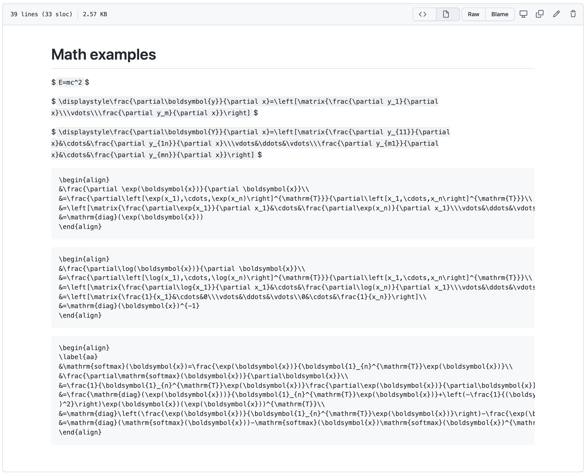

# gitmath

A chrome extension for rendering Github math equations, based on [MathJax](https://www.mathjax.org/).

## Features

- Insert a table of contents
- Numbering Heading
- Render math equations

## Math

### Inline math

- Input

  <pre>
  $f(a)=\frac{1}{2\pi i}\oint_y \frac{f(z)}{z-a}dz$
  </pre>

- Output

  $f(a)=\frac{1}{2\pi i}\oint_y \frac{f(z)}{z-a}dz$

### Multi-line math

Here we use _math code block_ as display math delimiters, that's because Github markdown parser will escape `\\`.

- Input

  <pre>
  ```math
  \begin{cases}
  3x + 5y +  z \\
  7x - 2y + 4z \\
  -6x + 3y + 2z
  \end{cases}
  ```
  </pre>

- Output

  ```math
  \begin{cases}
  3x + 5y +  z \\
  7x - 2y + 4z \\
  -6x + 3y + 2z
  \end{cases}
  ```

### `repl.py`

Usually, we use _double dollar_ signs as display math delimiters, but you can use `repl.py` to replace them with _math code block_, and vice versa.

- double dollar to math code block

  ```console
  python repl.py in.md out.md
  ```

- math code block to double dollar

  ```console
  python repl.py -r in.md out.md
  ```

### Examples

- Without gitmath

  

- With gitmath

  

## References

- <https://github.com/orsharir/github-mathjax>
